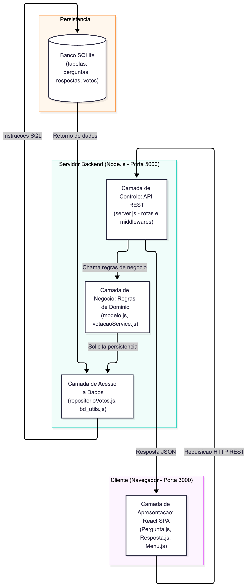

# Análise Arquitetural - ESM Forum
 
Análise da arquitetura atual do sistema ESM Forum com base nos conceitos do livro *Engenharia de Software Moderna* (Valente, Cap. 7).
 
---
 
## 1. Identificação do Estilo Arquitetural
 
O ESM Forum adota uma combinação de estilos arquiteturais modernos:
 
1. **Cliente-Servidor (Client-Server):** O sistema é fisicamente dividido em duas partes autônomas: o cliente web (frontend) e o servidor de aplicação (backend), que executam em processos e portas separadas.
2. **Single Page Application (SPA):** A interface do usuário é uma aplicação React de página única que roda inteiramente no navegador do cliente, atualizando o DOM dinamicamente sem recarregar a página.
3. **Variação de MVC Desacoplado:**  
   - **View (Visão):** Fica isolada no frontend (React SPA na porta 3000).
   - **Controller (Controlador):** Implementado no `server.js` (Express na porta 5000), gerenciando o roteamento HTTP.
   - **Model (Modelo):** Implementado no `modelo.js`, centralizando a manipulação de dados e regras de negócio.
 
---
 
## 2. Camadas Existentes e Responsabilidades
 
O sistema é dividido em três camadas lógicas bem definidas:
 
| Camada | Módulos / Arquivos | Responsabilidades |
| :--- | :--- | :--- |
| **Apresentação (Frontend)** | `esmforum-react` (`Pages/Pergunta.js`, `Pages/Resposta.js`, etc.) | Renderizar a interface, capturar eventos de clique/digitação do usuário e gerenciar o estado da tela com hooks do React (`useState`, `useEffect`). |
| **Controle e Negócio (Backend)** | `esmforum` (`server.js`, `modelo.js`, `votacaoService.js`) | Receber requisições HTTP, validar payloads, aplicar regras de negócio (ex: verificar votos) e intermediar o acesso ao banco. |
| **Persistência de Dados** | `bd/bd_utils.js`, `repositorioVotos.js` e SQLite | Executar comandos SQL (`SELECT`, `INSERT`, `UPDATE`, `DELETE`) e persistir os dados no disco. |
 
---
 
## 3. Comunicação Frontend-Backend
 
A integração entre cliente e servidor ocorre através de uma **API REST**:
- **Protocolo de Transporte:** HTTP assíncrono via chamadas `fetch` disparadas pelos componentes React.
- **Formato dos Dados:** Mensagens no padrão **JSON** tanto para o envio de formulários (`POST`) quanto para o retorno de consultas (`GET`).
- **Resolução de Origem Cruzada (CORS):** Como o frontend roda em `http://localhost:3000` e a API em `http://localhost:5000`, o `server.js` implementa um middleware que adiciona cabeçalhos `Access-Control-Allow-Origin: *` nas respostas, permitindo que o navegador aceite as requisições sem bloqueio de segurança.
 
---
 
## 4. Diagrama Arquitetural
 
O diagrama abaixo ilustra os componentes do sistema, suas camadas e o fluxo de dados:
 

*(Código-fonte disponível em `diagramas/diagrama_arquitetura.mmd`)*
 
### Fluxo de Dados:
1. O usuário interage com a tela no React (**Apresentação**).
2. O React dispara uma requisição HTTP REST via `fetch` enviando JSON para o `server.js` (**Controle**).
3. O `server.js` valida a entrada e repassa os parâmetros para as funções do `modelo.js` (**Negócio**).
4. O modelo executa as instruções SQL no SQLite através do `bd_utils.js` (**Dados**).
5. O resultado percorre o caminho inverso e a interface atualiza o estado local da tela.