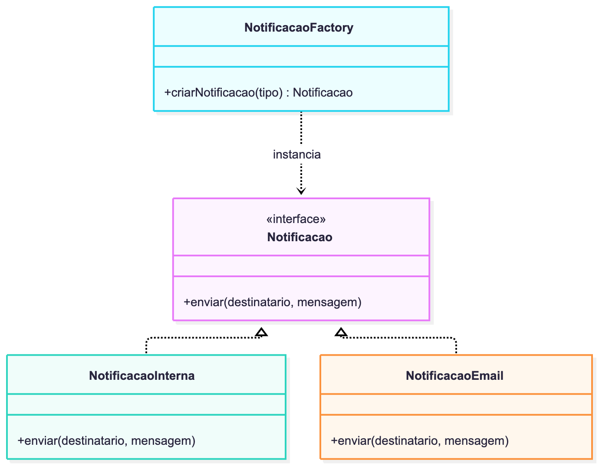
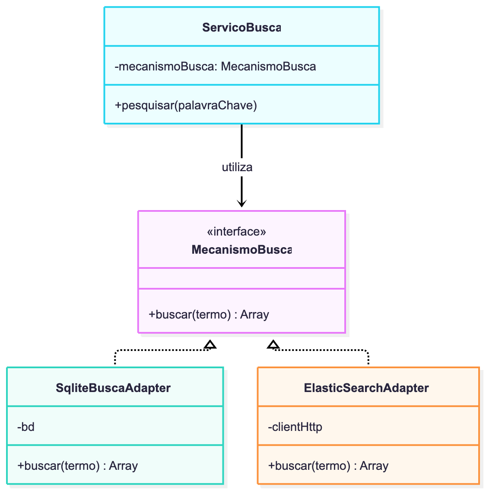
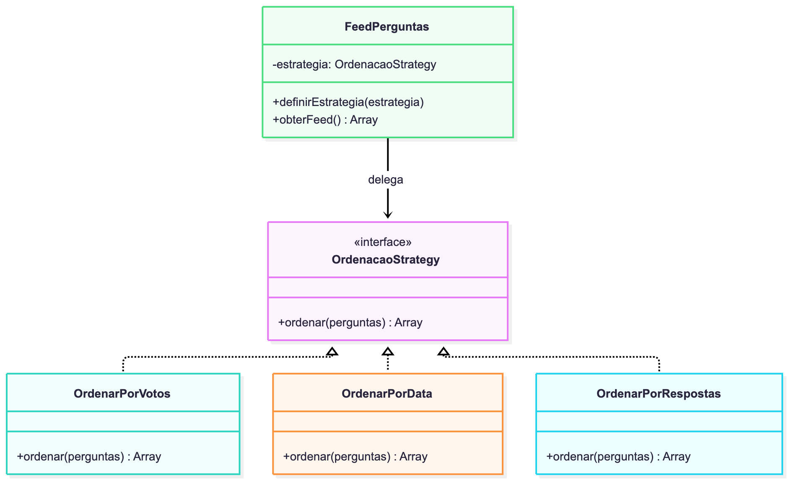

# Proposta de Aplicação de Padrões de Projeto - ESM Forum
 
Este documento propõe a aplicação de 3 padrões de projeto (Criacional, Estrutural e Comportamental) para expandir e modularizar as funcionalidades do ESM Forum.
 
---
 
## 1. Padrão Criacional: Factory Method
 
### a) Justificativa e Contexto
- **Funcionalidade:** US-05 (Notificação de novas respostas).
- **Problema:** Quando uma pergunta recebe uma nova resposta, o sistema deve avisar o autor. Inicialmente, o aviso é uma notificação interna no fórum. Porém, há planos para suportar notificações por e-mail e notificações push. Criar essas instâncias diretamente na rota geraria acoplamento com múltiplos blocos de `if/else`.
- **Por que é adequado:** O **Factory Method** encapsula a lógica de criação de objetos, permitindo que a aplicação solicite uma notificação sem precisar conhecer a classe concreta ou os parâmetros de conexão de cada canal.
 
### b) Proposta de Solução e Diagrama
Criar uma interface comum `Notificacao` com o método `enviar(destinatario, mensagem)` e uma classe fábrica `NotificacaoFactory` responsável por instanciar a classe adequada (`NotificacaoInterna`, `NotificacaoEmail`).
 
**Diagrama de Classes:**

*(Código-fonte disponível em `diagramas/padrao_factory.mmd`)*
 
### c) Exemplo de Código
```javascript
// Interface base conceitual
class Notificacao {
  enviar(destinatario, mensagem) {
    throw new Error('Método deve ser implementado');
  }
}
 
// Implementações concretas
class NotificacaoInterna extends Notificacao {
  enviar(idUsuario, mensagem) {
    return bd.exec('INSERT INTO notificacoes (id_usuario, texto) VALUES (?, ?)', [idUsuario, mensagem]);
  }
}
 
class NotificacaoEmail extends Notificacao {
  enviar(email, mensagem) {
    // Integração com serviço SMTP/SendGrid
    console.log(`Enviando e-mail para ${email}: ${mensagem}`);
  }
}
 
// Factory Method
class NotificacaoFactory {
  static criar(tipo) {
    switch (tipo) {
      case 'EMAIL':
        return new NotificacaoEmail();
      case 'INTERNA':
      default:
        return new NotificacaoInterna();
    }
  }
}
```
 
---
 
## 2. Padrão Estrutural: Adapter
 
### a) Justificativa e Contexto
- **Funcionalidade:** US-02 (Busca de perguntas por palavra-chave).
- **Problema:** A busca inicial é feita com consultas SQL simples usando `LIKE` no SQLite. Conforme o fórum acumular milhares de mensagens, essa busca ficará lenta e será necessário adotar uma ferramenta de busca textual dedicada (como FlexSearch ou Elasticsearch).
- **Por que é adequado:** O padrão **Adapter** cria uma camada intermediária padronizada. Assim, a regra de negócio da busca conversa com uma interface única; se o motor de busca for substituído no futuro, basta criar um novo adaptador sem alterar a rota ou o frontend.
 
### b) Proposta de Solução e Diagrama
Definir uma interface `MecanismoBusca` contendo o método `buscar(termo)`. Classes adaptadoras específicas traduzem a chamada para a biblioteca correspondente (`SqliteBuscaAdapter`, `ElasticSearchAdapter`).
 
**Diagrama de Classes:**

*(Código-fonte disponível em `diagramas/padrao_adapter.mmd`)*
 
### c) Exemplo de Código
```javascript
// Interface alvo esperada pelo sistema
class MecanismoBusca {
  buscar(termo) {
    throw new Error('Método buscar deve ser implementado');
  }
}
 
// Adaptador para o banco SQLite atual
class SqliteBuscaAdapter extends MecanismoBusca {
  constructor(bd) {
    super();
    this.bd = bd;
  }
 
  buscar(termo) {
    const padrao = `%${termo}%`;
    return this.bd.queryAll(
      'SELECT * FROM perguntas WHERE texto LIKE ?',
      [padrao]
    );
  }
}
 
// Serviço que consome o adaptador sem saber qual motor está por trás
class ServicoBusca {
  constructor(adaptadorBusca) {
    this.buscador = adaptadorBusca;
  }
 
  executarBusca(termo) {
    if (!termo || termo.trim() === '') return [];
    return this.buscador.buscar(termo.trim());
  }
}
```
 
---
 
## 3. Padrão Comportamental: Strategy
 
### a) Justificativa e Contexto
- **Funcionalidade:** US-01 (Votação e Exibição do Feed de Perguntas).
- **Problema:** Os usuários do fórum precisam alternar a exibição da lista de perguntas de acordo com sua preferência: por **Mais Recentes** (ordem cronológica), por **Mais Votadas** (maior saldo de votos) ou por **Mais Respondidas**. Colocar cláusulas `if/switch` com diferentes blocos SQL dentro de uma única função torna o código frágil e difícil de testar.
- **Por que é adequado:** O padrão **Strategy** encapsula cada algoritmo de ordenação em uma classe separada com uma interface comum, permitindo que o feed troque de estratégia dinamicamente conforme o filtro selecionado pelo usuário.
 
### b) Proposta de Solução e Diagrama
Criar a interface `OrdenacaoStrategy` com o método `ordenar(perguntas)`. Cada estratégia concreta implementa sua regra de classificação (`OrdenarPorVotos`, `OrdenarPorData`, `OrdenarPorRespostas`).
 
**Diagrama de Classes:**

*(Código-fonte disponível em `diagramas/padrao_strategy.mmd`)*
 
### c) Exemplo de Código
```javascript
// Interface da Estratégia
class OrdenacaoStrategy {
  ordenar(perguntas) {
    throw new Error('Método ordenar deve ser implementado');
  }
}
 
// Estratégias concretas
class OrdenarPorVotos extends OrdenacaoStrategy {
  ordenar(perguntas) {
    return [...perguntas].sort((a, b) => (b.saldo_votos || 0) - (a.saldo_votos || 0));
  }
}
 
class OrdenarPorData extends OrdenacaoStrategy {
  ordenar(perguntas) {
    return [...perguntas].sort((a, b) => b.id_pergunta - a.id_pergunta);
  }
}
 
class OrdenarPorRespostas extends OrdenacaoStrategy {
  ordenar(perguntas) {
    return [...perguntas].sort((a, b) => (b.num_respostas || 0) - (a.num_respostas || 0));
  }
}
 
// Contexto que utiliza a estratégia escolhida pelo cliente
class FeedPerguntas {
  constructor(estrategiaInicial) {
    this.estrategia = estrategiaInicial;
  }
 
  definirEstrategia(novaEstrategia) {
    this.estrategia = novaEstrategia;
  }
 
  obterPerguntasOrdenadas(perguntas) {
    return this.estrategia.ordenar(perguntas);
  }
}
```