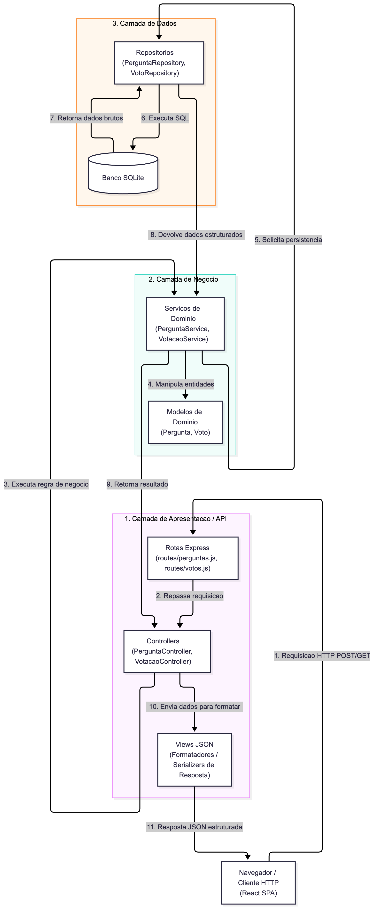

# Proposta de Organização Arquitetural - ESM Forum
 
Proposta de reestruturação arquitetural do backend do ESM Forum, adotando separação estrita em camadas e o padrão MVC para suportar novas funcionalidades de forma escalável e manutenível.
 
---
 
## 1. Proposta de Separação em Camadas
 
Atualmente, o backend concentra muitas decisões no `server.js` e no `modelo.js`. Para permitir a evolução do sistema sem gerar acoplamento, o código deve ser organizado em três camadas concêntricas e desacopladas:
 
```text
src/
├── presentation/   # Camada de Apresentação (Rotas, Controllers, Views JSON)
├── business/       # Camada de Negócio (Serviços de Domínio e Entidades)
└── data/           # Camada de Dados (Repositórios e Conexão SQLite)
```
 
---
 
### a) Camada de Apresentação (API Routes & Controllers)
- **Responsabilidades:**  
  Receber requisições HTTP, validar o formato dos parâmetros recebidos (`params`, `query`, `body`), repassar a execução para a camada de negócio e despachar a resposta HTTP com os devidos códigos de status (`200`, `201`, `400`, `404`, `500`).
- **Módulos que fariam parte:**
  - `routes/perguntasRoutes.js`: Mapeamento dos verbos HTTP para o recurso `/perguntas`.
  - `routes/votosRoutes.js`: Mapeamento das rotas de votação.
  - `controllers/PerguntaController.js`: Lógica de controle de perguntas.
  - `controllers/VotacaoController.js`: Lógica de controle de votos.
  - `views/`: Formatadores de saída JSON.
- **Comunicação:**  
  Não acessa o banco de dados diretamente. Chama apenas os métodos da Camada de Negócio.
 
---
 
### b) Camada de Negócio (Lógica de Aplicação)
- **Responsabilidades:**  
  Conter as regras e políticas de domínio da aplicação, independentemente do protocolo de transporte (seja HTTP, CLI ou fila). É responsável por garantir invariantes de negócio (ex: usuário só pode votar uma vez, pergunta precisa de texto válido, saldo de votos deve ser recalculado corretamente).
- **Módulos que fariam parte:**
  - `services/VotacaoService.js`: Regras de registro, alternância e cancelamento de votos.
  - `services/PerguntaService.js`: Regras para criação e listagem de perguntas com filtros.
  - `domain/Pergunta.js` e `domain/Voto.js`: Entidades do domínio contendo validações estruturais.
- **Comunicação:**  
  Recebe dados simples dos Controllers e solicita leitura/escrita através de interfaces de Repositório (Camada de Dados), sem conhecer comandos SQL.
 
---
 
### c) Camada de Dados (Acesso ao Banco)
- **Responsabilidades:**  
  Encapsular toda a infraestrutura de persistência, conexão com o SQLite e montagem das instruções SQL.
- **Módulos que fariam parte:**
  - `repositories/PerguntaRepository.js`: Execução de `SELECT`, `INSERT` na tabela `perguntas`.
  - `repositories/VotoRepository.js`: Consultas e comandos na tabela `votos`.
  - `database/connection.js`: Gerenciamento da conexão com o banco SQLite.
- **Comunicação:**  
  Executa instruções no banco de dados e retorna objetos de domínio ou coleções de dados simples para a Camada de Negócio.
 
---
 
## 2. Aplicação do Padrão MVC no Backend
 
No contexto de APIs REST desacopladas de SPA, o padrão MVC adapta-se para que as **Views** sejam representações JSON em vez de páginas HTML pré-renderizadas.
 
A proposta detalha a aplicação do MVC para duas funcionalidades essenciais: **Perguntas** e **Votação**.
 
### Estrutura dos Componentes:
 
#### 1. Models (Modelos)
- **O que modelam:**  
  Os dados essenciais e as regras do domínio.
  - `PerguntaModel`: Contém `id_pergunta`, `texto`, `id_usuario`, `data_criacao` e métodos de validação (ex: verificar se o texto tem entre 5 e 500 caracteres).
  - `VotoModel`: Contém `id_pergunta`, `id_usuario`, `tipo` (+1 ou -1) e regras de compatibilidade.
- **Operações:**  
  Validações de domínio, cálculos internos de pontuação e agregação.
 
#### 2. Controllers (Controladores)
- **O que fazem:**  
  Orquestram o fluxo de entrada e saída.
  - `PerguntaController`:
    - `listar(req, res)`: Chama o serviço de perguntas e devolve o array formatado.
    - `criar(req, res)`: Extrai o payload, aciona o serviço e devolve status `201 Created`.
  - `VotacaoController`:
    - `votar(req, res)`: Extrai ID da pergunta e do usuário, chama o `VotacaoService` e devolve o novo saldo consolidado.
 
#### 3. Views (Visões JSON / Presenters)
- **O que fazem:**  
  Padronizam o formato de entrega das respostas para o frontend, ocultando campos sensíveis ou internos.
  - `PerguntaView.render(pergunta)`: Formata uma pergunta garantindo a estrutura:
    ```json
    {
      "id": 1,
      "texto": "Como remover elemento de array em JS?",
      "autor_id": 1,
      "total_respostas": 2,
      "saldo_votos": 5
    }
    ```
  - `ErrorView.render(mensagem, codigo)`: Padroniza erros em formato uniforme:
    ```json
    { "error": true, "message": "Pergunta não encontrada", "code": 404 }
    ```
 
---
 
## 3. Diagrama da Arquitetura MVC Proposta
 
O diagrama a seguir apresenta o fluxo completo dos componentes da proposta:
 

*(Código-fonte disponível em `diagramas/diagrama_mvc.mmd`)*
 
---
 
## 4. Exemplo de Fluxo Completo: Votar em uma Pergunta (`POST /perguntas/:id/voto`)
 
1. **Requisição:** O cliente React faz `POST http://localhost:5000/perguntas/1/voto` enviando `{ "id_usuario": 1, "tipo": 1 }`.
2. **Roteamento:** O Express direciona a requisição para o método `VotacaoController.votar`.
3. **Controlador:** O controller extrai `id_pergunta = 1`, `id_usuario = 1` e `tipo = 1`, repassando para `VotacaoService.votar(...)`.
4. **Serviço de Negócio:** O serviço consulta o `VotoRepository` para verificar se já existe voto registrado.
5. **Persistência:**
   - Se for o primeiro voto, o repositório executa o `INSERT INTO votos`.
   - O repositório calcula a soma consolidada via `SUM(tipo)` e retorna o saldo atualizado.
6. **Retorno ao Controlador:** O serviço devolve um objeto `{ status: 'registrado', saldo_votos: 5 }`.
7. **Visão (View JSON):** O controller aciona a `VotoView.render(...)` para serializar o payload padrão.
8. **Resposta HTTP:** O controller envia a resposta com status `200 OK` em JSON para o cliente.